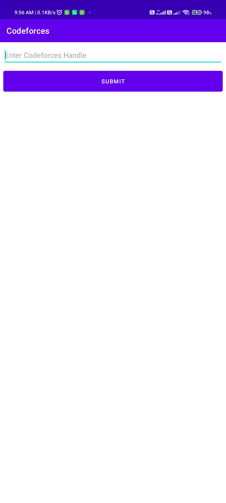

# CodefInfo  
Android app using Codeforces API.

## Screenshot

  

## What this app does ?
This app retrieves user information from the Codeforces API and uses it to populate the list.
The Codeforces API is used by this Android app to retrieve information about a user based on their Codeforces username.
Examine the user's ratings and submissions. 

## Why ?

Learned how to leverage the repository model and MVVM in this programme (WIP).
It helped me improve my Kotlin programming abilities.
Learned how to retrieve data from the internet using Retrofit.

## What Next ?
Working on making it more user-friendly and adding more features, as well as improving the repository section, which isn't yet fully implemented yet.

## Issues and Suggestions
Open to feedback and suggestions amresh564@gmail.com
